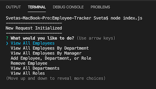
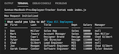

# [Employee Management System](https://github.com/sdemkovich/Employee-Tracker)

## Description

Employee Management System is a command-line, Content Management System, 
that allows business owners to easily manage and track information about their employees. 
The user is first presented with a series of choices about what action they would like to complete,
 and then prompted with a series of follow up questions, based on that choice. 
 The user may choose to view, add, or delete employees, roles, and departments. 
 They may also choose to update the employees role or manager at any time. 
 Once the user has answered the follow up questions, their chosen action is completed 
 and they may choose another action, or choose to exit the program at any time.


## Table of Contents
* [Usage](#usage)
* [Technologies](#technologies)
* [Installation](#Installation)
* [Finished Product](#finished-product)
* [Questions](#questions)

## Usage
* Navigate to Employee Tracker directory and install dependencies.
* Run node index.js to begin.
* Choose an action:
    * View all Employees
    * View all Employees By Department
    * View all Employees By Manager
    * Add Employee, Department or Role
    * Remove Employee
    * View all Departments
    * View all Roles
    * Exit
* Answer follow up questions based on action chosen.
* Action is executed based on answers.
* Choose "Exit" to exit the program.

   
<br>
  

## Technologies
* Node.js 
* MySQL
* JavaScript
* npm package
* Inquirer.js

## Installation
To install necessary dependencies, run the following command: 
``` 
npm install 
``` 

## Finished Product
View a video demonstrating the full application [here](https://drive.google.com/file/d/1emB8x196ZImz3icj17zzFqncu6FjqtkM/view)

## Questions
​
If you have any questions about the repo, please contact me:

On GitHub: [sdemkovich](https://github.com/sdemkovich) 
